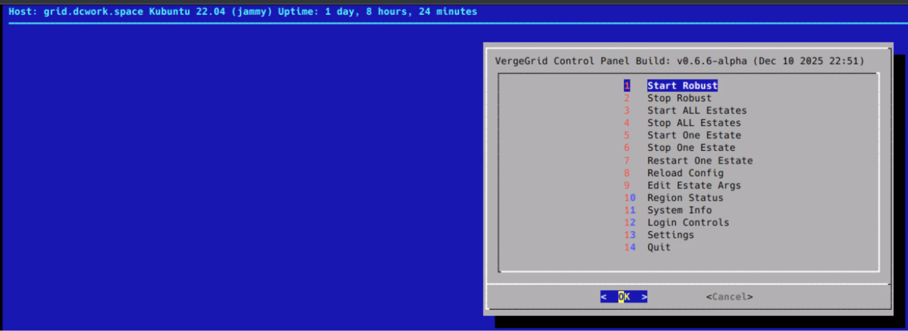

====================================================================

# VergeGrid TUI Control Panel

A lightweight terminal based control panel for managing VergeGrid estates, regions, logs, OpenSim instances, and system health. This project serves as the first stage of the larger VergeGrid Control Panel ecosystem.

---

## Overview

This repository contains the standalone TUI version of the VergeGrid control system. It provides local administrative tools for OpenSim servers, including:

- Estate scanning  
- Region enumeration  
- Port registry reading  
- System stats (CPU, RAM, Disk, Network)  
- Quick launch shell wrappers  
- Future service manager integration  

The TUI is intentionally modular and designed to eventually evolve into:

- A PySide6 GUI (separate repo)  
- A WebUI (separate repo)  
- A combined final release in the master VergeGrid Control Panel repo  

---

## Screenshot

  

---

## Quick Start

Usage instructions are available in:  
**[USAGE.md](./USAGE.md)**

---

## Project Structure

src/
tui/
core.py
menu.py
stats.py
helpers.py
themes.py
utils/
detect_root.py
estate_scanner.py
opensim_ports.py
docs/
requirements.txt
CHANGELOG.md
LICENSE

---

Apache 2.0 Licensed

VergeGrid Control Panel • TUI Module

====================================================================